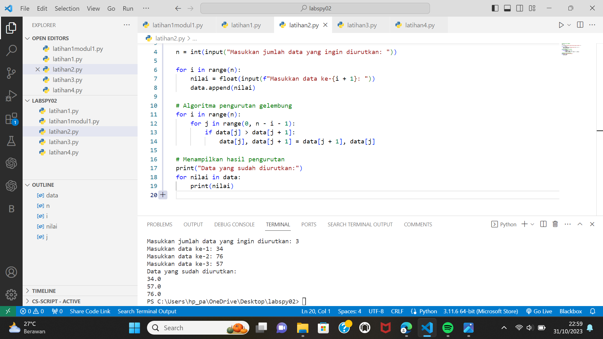
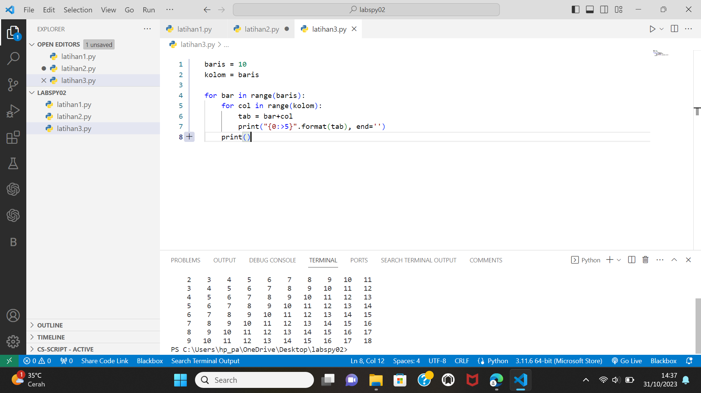
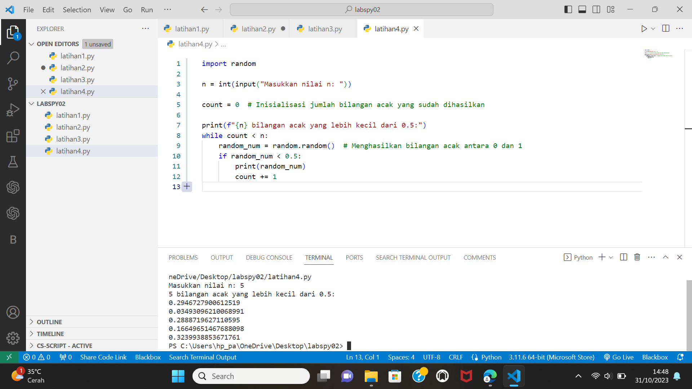

# praktikum 7
Buat program sederhana dengan input tiga buah bilangan, dari ketiga bilangan
tersebut tampilkan bilangan terbesarnya. Gunakan statement if.

# Meminta input dari pengguna
 a = float(input("Masukkan bilangan pertama: "))
 b = float(input("Masukkan bilangan kedua: "))
 c = float(input("Masukkan bilangan ketiga: "))

# Menggunakan statement if untuk menentukan bilangan terbesar
 if a > b and a > c:
    bilangan_terbesar = a
 elif b > a and b > c:
     bilangan_terbesar = b
 else:
     bilangan_terbesar = c

# Menampilkan bilangan terbesar
 print("Bilangan terbesar adalah:", bilangan_terbesar)
    
# Hasil perogram
    

    
# Menampilkan flowchart
    

# Tugas struktur kondisi

# latihan 1
Buat program sederhana dengan input 2 buah bilangan, kemudian tentukan bilangan terbesar dari kedua bilangan tersebut menggunakan statement if.

 # Meminta input dari pengguna
 bilangan1 = float(input("Masukkan bilangan pertama: "))
 bilangan2 = float(input("Masukkan bilangan kedua: "))

# Menentukan bilangan terbesar
 if bilangan1 > bilangan2:
     terbesar = bilangan1
 else:
     terbesar = bilangan2

# Menampilkan bilangan terbesar
 print("Bilangan terbesar adalah:", terbesar)
    
# Hasil perogram

# latihan 2
Buat program untuk mengurutkan data berdasarkan input sejumlah
data (minimal 3 variable input atau lebih), kemudian tampilkan
hasilnya secara berurutan mulai dari data terkecil.

# Input data dari pengguna
 data = []
 n = int(input("Masukkan jumlah data yang ingin diurutkan: "))
 for i in range(n):
     nilai = float(input(f"Masukkan data ke-{i + 1}: "))
     data.append(nilai)

# Algoritma pengurutan gelembung
 for i in range(n):
     for j in range(0, n - i - 1):
         if data[j] > data[j + 1]:
             data[j], data[j + 1] = data[j + 1], data[j]

# Menampilkan hasil pengurutan
 print("Data yang sudah diurutkan:")
 for nilai in data:
     print(nilai)

   # Hasil perogram

   

   # Tugas perulangan

   # latihan 1
   Buat program dengan perulangan bertingkat (nested) for yang menghasilkan output sebagai berikut
  
 1.pendeklarasian variable
    baris = 10
 kolom = baris

 2.untuk perulangan baris dan kolom menggunakan for
 for bar in range(baris):
     for col in range(kolom):
         tab = bar+col
   
 3.agar terlihat rapih menggunakan format string rata kekanan sebanyak 5 karakter
         agar tidak membuat garis baru menggunakan end=' ' (baris)
         print("{0:>5}".format(tab), end='')
     print()

   # Hasil perogram

   

   # latihan 2
   Tampilkan n bilangan acak yang lebih kecil dari 0.5. nilai n diisi pada saat runtime anda bisa menggunakan kombinasi while dan for untuk menyelesaikannya
  
 import random

 n = int(input("Masukkan nilai n: "))

 count = 0  # Inisialisasi jumlah bilangan acak yang sudah dihasilkan

 print(f"{n} bilangan acak yang lebih kecil dari 0.5:")
 while count < n:
     random_num = random.random()  # Menghasilkan bilangan acak antara 0 dan 1
     if random_num < 0.5:
         print(random_num)
         count += 1

# Hasil perogram

   

